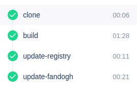

# Fandogh Drone Plugin




If you are using [Drone CI](https://drone.io/) and [Fandogh PaaS](https://fandogh.cloud/), you can use this drone plugin!

Example for [.drone.yml](https://docs.drone.io/pipeline/docker/overview/):
```
- name: update-fandogh

  image: amirbagh75/fandogh-drone:latest
  settings:
    username: 
      from_secret: fandoghuser
    password: 
      from_secret: fandoghpass
    version: ${DRONE_COMMIT}
    registry: "myregistry.com:5000" ## optional
    manifest_path: ./fandogh.yml

  when:
    branch:
    - master
```
---
Example for [fandogh.yml](https://docs.fandogh.cloud/docs/service-manifest.html) file:
```
kind: InternalService
name: example
spec:
  image: library/image:${VERSION} ## ${VERSION} must exist in your fandogh.yml file.
  image_pull_policy: IfNotPresent
  replicas: 1
  port_mapping:
  - port: 50052
    target_port: 50052
    protocol: tcp
  env:
  - name: GO_ENV
    value: "production"
```

or if you have custom docker registry:
```
kind: InternalService
name: example
spec:
  image: ${REGISTRY}/image:${VERSION} ## ${VERSION} & ${REGISTRY} must exist in your fandogh.yml file!
  image_pull_policy: IfNotPresent
  replicas: 1
  port_mapping:
  - port: 50052
    target_port: 50052
    protocol: tcp
  env:
  - name: GO_ENV
    value: "production"
```

